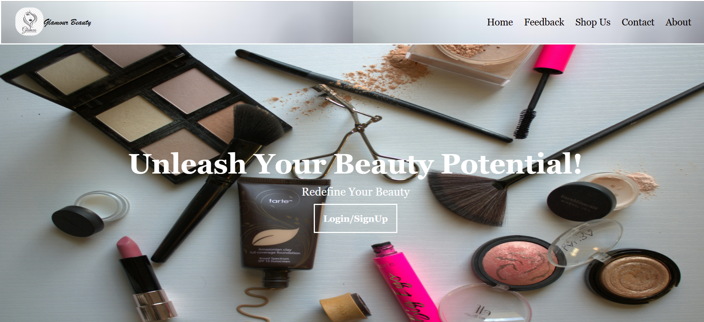
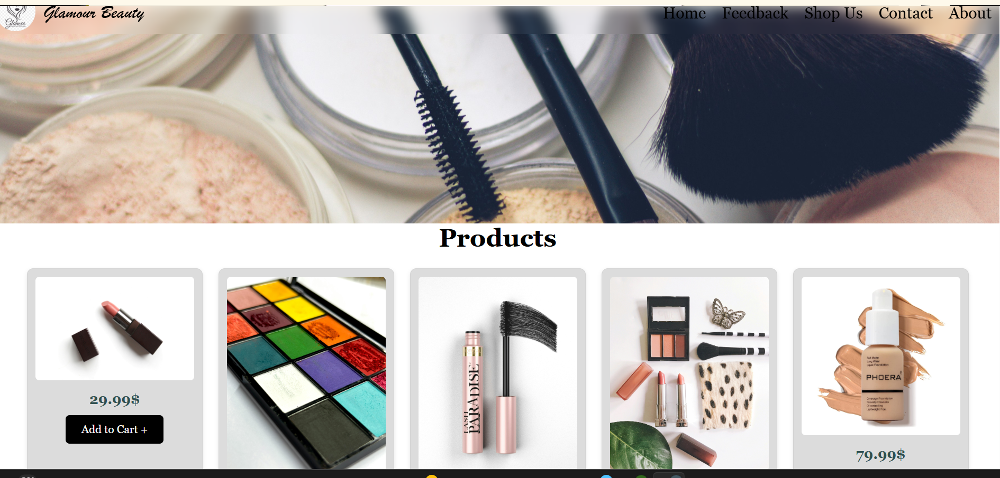
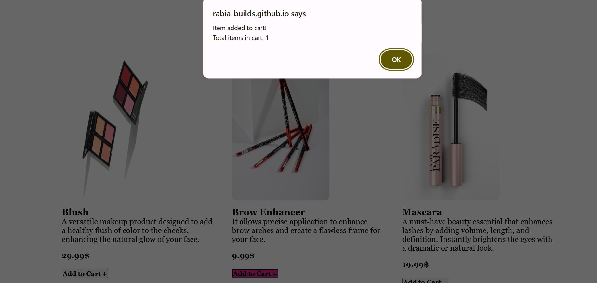
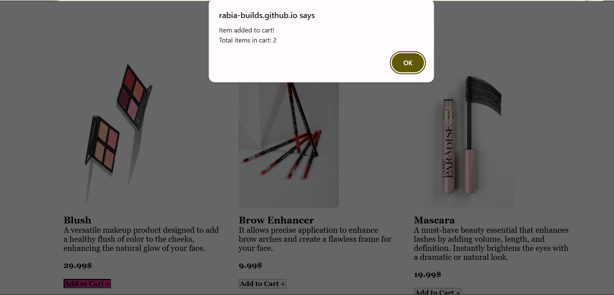
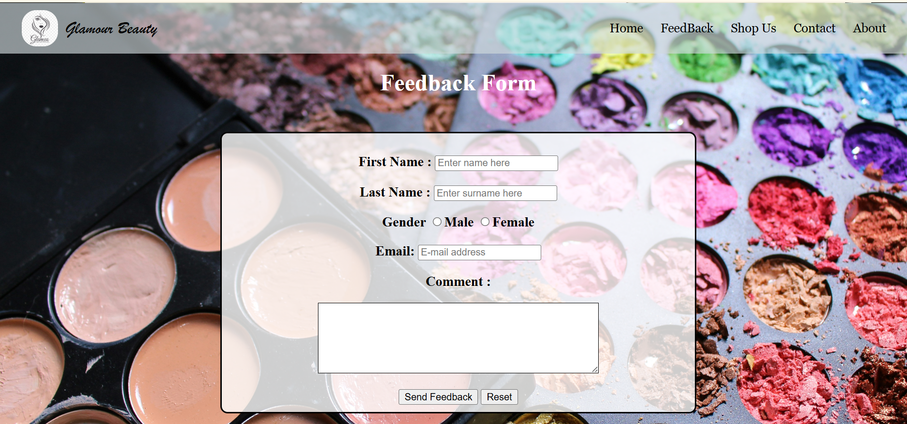
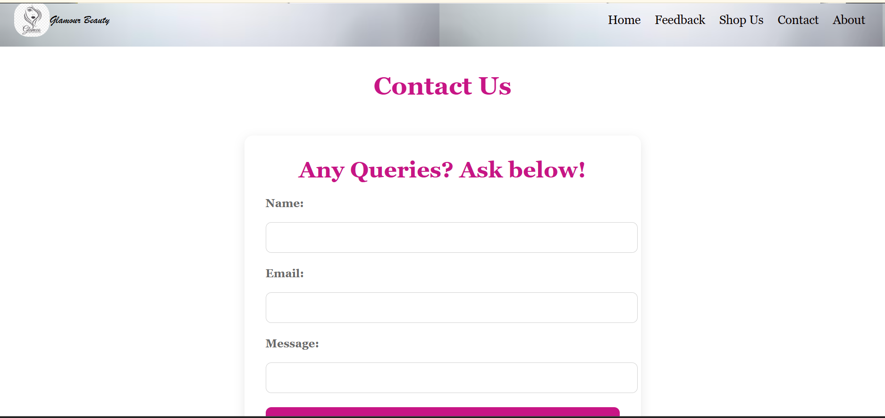
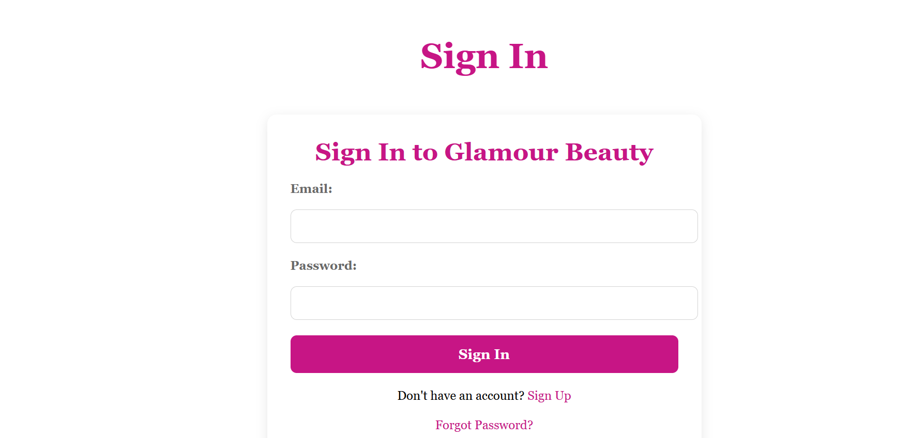
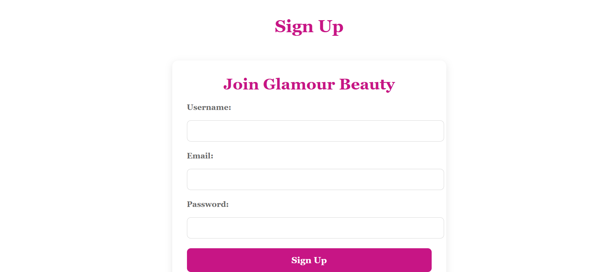
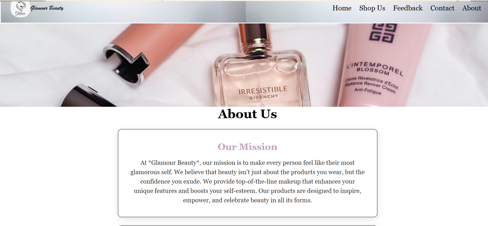

# 💄 Glamour Beauty – Makeup E-Commerce Website

A responsive multi-page makeup brand website built using **HTML, CSS, and JavaScript (inline/embedded)**.
The project simulates an e-commerce experience with interactive cart functionality and multiple user pages.

---

## 🌐 Live Demo

👉 [https://rabia-builds.github.io/makeup-website-frontend/](https://rabia-builds.github.io/makeup-website-frontend/)

---
## 📸 Screenshots

### 🏠 Home Page


.png)

### 🛍️ Shop Page


### 🛒 Cart System
  


### 💬 Feedback Page


### 📞 Contact Page


### 👤 Sign In Page


### 🆕 Sign Up Page


### ℹ️ About Page


---
## ✨ Features

* 🏠 Modern home/landing page
* 🛍️ Product listing for makeup items
* 🛒 **Add to Cart functionality using JavaScript**
* 🔢 **Live cart counter updates dynamically**
* 💬 Feedback / Wishlist page
* 📞 Contact page
* 👤 Sign In page (email input with validation)
* 🆕 Sign Up page (basic form structure)
* 🎨 Attractive UI design using CSS
* 📱 Responsive multi-page layout
* 🔗 Navigation between pages

---

## ⚙️ Functional Highlights

* Users can add items to cart dynamically
* Cart counter updates instantly using JavaScript
* Email validation used in forms
* No page reload required for cart updates
* Fully frontend-based interactive UI

---

## 🛠️ Technologies Used

* HTML5
* CSS3
* JavaScript (embedded / inline DOM manipulation)
* Image assets for UI design

---

## 📁 Project Structure

```text id="structure"
index.html          → Shop / Home page  
glamourbeauty.html  → Main landing page  
about1.html         → About page  
contact1.html       → Contact page  
wishlist.html       → Feedback/Wishlist page  
signin.html         → Login page  
signup.html         → Signup page  
styling.css         → Main stylesheet  
photos/             → All images used in project  
```

---

## 🎯 Purpose of Project

This project was built to practice:

* Multi-page website development
* JavaScript DOM manipulation
* Interactive cart system logic
* Frontend UI/UX design
* Real-world e-commerce simulation

---

## 🚀 How to Run Locally

1. Download or clone the repository
2. Open `index.html` in browser
3. Navigate through pages
4. Add items to cart and test functionality

---

## 👩‍💻 Author

**Rabia**

---

## 📌 Note

This is a **frontend-only project**.
JavaScript is implemented within HTML files for cart functionality and interactivity.

---

## ⭐ Future Improvements

* Store cart data using localStorage
* Add separate JavaScript file for better structure
* Add checkout page
* Add animations and transitions

---


Just tell me 👍
